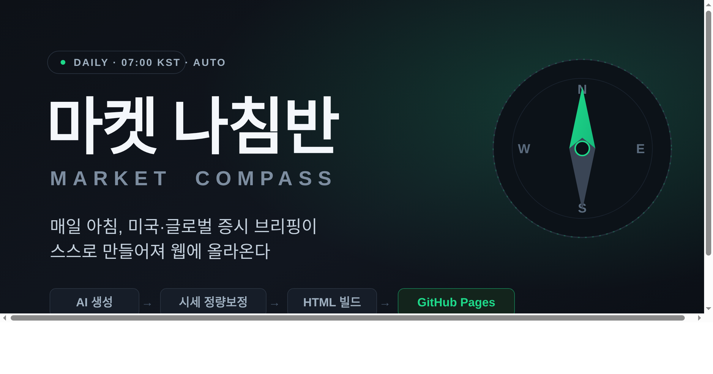
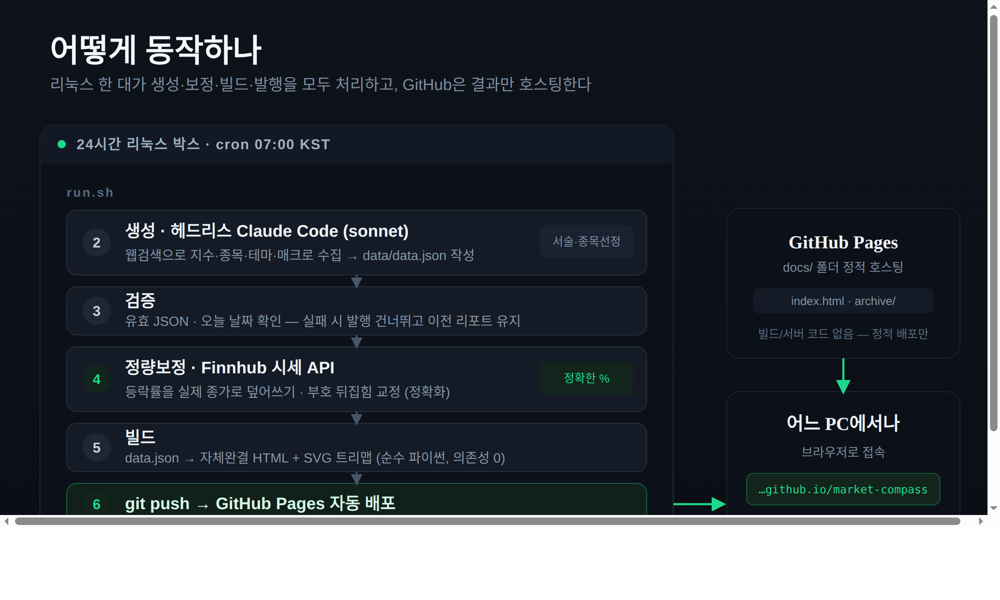
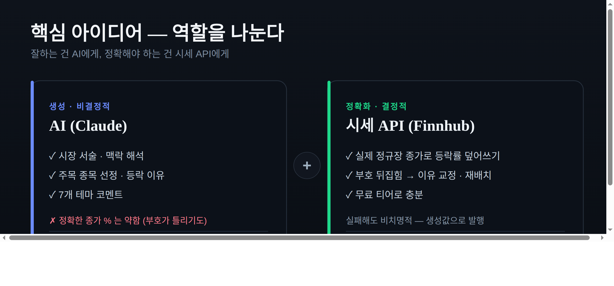
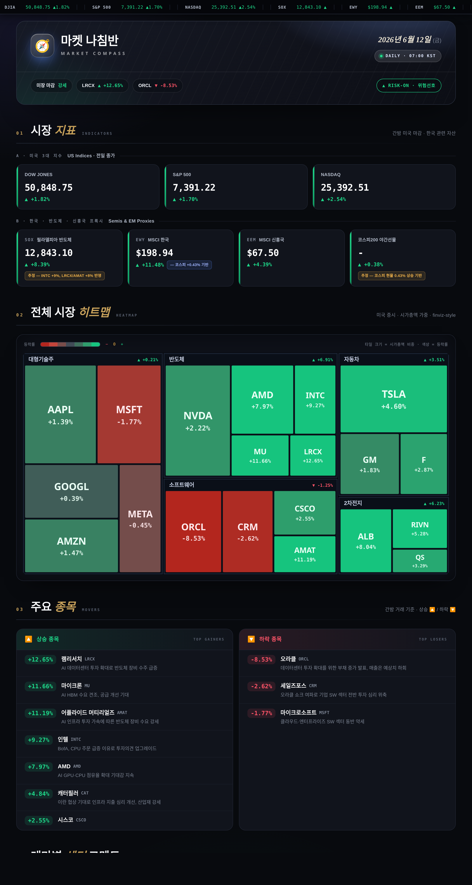

# 🧭 매일 아침, 증시 브리핑이 스스로 만들어지게 했다 — '마켓 나침반' 만든 이야기

> **🔗 라이브 사이트:** https://jsleeethan.github.io/market-compass/

매일 아침 미국장이 끝나면, 어젯밤 시장이 어땠는지 한 장으로 정리된 브리핑이 자동으로 만들어져 웹에 올라옵니다. 출근길에 휴대폰으로, 회사 PC로, 어디서든 주소만 치면 볼 수 있죠. 사람이 손대는 건 없습니다. **'마켓 나침반(Market Compass)'** 이야기를 풀어봅니다.

---

## 시작은 작은 불편이었다

원래는 집에 있는 윈도우 PC의 예약 작업으로 매일 아침 브리핑을 만들고 있었습니다. 문제는 **그 PC가 켜져 있을 때, 그 PC 앞에서만** 볼 수 있다는 것. 회사에서, 카페에서, 폰으로 보고 싶은데 방법이 없었습니다.

> "이걸 클라우드에 올려서 **어느 PC에서나 웹으로** 보면 안 될까?"

그래서 구조를 통째로 다시 짰습니다. 핵심 목표는 두 가지였어요.

- **어디서나 본다** — 특정 PC·앱에 묶이지 않게
- **추가 비용은 0에 가깝게** — 서버를 새로 빌리지 않고

---

## 어떻게 동작하나 — 리눅스 한 대가 다 한다

집에 24시간 켜져 있는 리눅스 박스 한 대가 **생성 → 보정 → 빌드 → 발행** 을 전부 처리합니다. GitHub은 완성된 결과물을 호스팅만 하고요. 매일 아침 7시(한국시간)에 일어나는 일은 이렇습니다.

1. **생성** — 헤드리스로 띄운 AI(Claude)가 웹을 검색해 지수·종목·테마·환율·일정을 모아 `data.json` 한 장으로 정리
2. **검증** — JSON이 멀쩡한지, 날짜가 오늘인지 확인. 이상하면 발행을 건너뛰고 어제 리포트를 그대로 둠
3. **정량보정** — 종목 등락률을 실제 시세 API(Finnhub) 종가로 덮어써 **숫자를 정확화**
4. **빌드** — 데이터를 자체완결형 HTML로 변환 (히트맵까지 순수 파이썬으로 SVG 직접 그림, 외부 라이브러리 0개)
5. **발행** — `git push` 한 줄. GitHub Pages가 알아서 배포

서버 코드도, 복잡한 배포 파이프라인도 없습니다. **이미 만들어진 HTML을 정적으로 내보낼 뿐**이라 호스팅은 완전 무료입니다.

---

## 가장 신경 쓴 부분 — AI는 글을, 숫자는 API에게

만들면서 가장 중요하게 잡은 원칙입니다.

AI는 **시장을 서술하고, 맥락을 해석하고, 주목할 종목을 고르는 일**엔 정말 강합니다. 그런데 "엔비디아가 어제 정확히 몇 % 올랐나" 같은 **정확한 종가 %는 의외로 약해요.** 웹 검색에 의존하다 보니 부호가 거꾸로 나오는 경우까지 있었습니다.

그래서 역할을 갈랐습니다.

- **서술·종목 선정·테마 코멘트** → AI가 담당
- **정확한 등락률 숫자** → 시세 API로 결정적으로 덮어쓰기

부호가 뒤집히면 잘못 쓰인 "상승 이유" 서술을 지우고 하락 칼럼으로 재배치까지 합니다. "잘하는 건 AI에게, 정확해야 하는 건 API에게" — 이 분리가 리포트 신뢰도의 핵심이었습니다.

---

## 리포트엔 뭐가 담기나

매일 아침 한 장에 이만큼이 들어갑니다.

- 미국 3대 지수 + 필라델피아 반도체·MSCI 한국/신흥국·코스피200 야간선물
- 시총 가중 **시장 히트맵** (finviz 스타일, SVG 트리맵)
- 주목 종목 상승/하락 + **각각의 등락 이유**
- 반도체·자동차·2차전지·대형기술주·소프트웨어·양자컴퓨터·비트코인 **7개 테마 코멘트**
- 미 국채금리·연준·환율·유가·코스피 등 **매크로**
- 오늘 / 이번 주 / 이번 달 **경제 일정**

디자인은 Playfair·Inter 기반의 다크 에디토리얼 톤으로, 폰트만 외부에서 불러오고 나머지는 전부 한 파일에 담은 자체완결형 HTML입니다.

---

## 결과

- **어디서나** → https://jsleeethan.github.io/market-compass/ 주소만 있으면 끝
- **사람 손 0** → 매일 아침 cron이 알아서 갱신
- **추가 비용 0에 수렴** → 생성은 기존 AI 구독, 호스팅·자동화·시세보정은 전부 무료 티어
- **꺼져도 안전** → 리눅스가 쉬는 날엔 마지막 리포트가 그대로 남아 있음

작은 불편에서 출발했지만, "AI 생성 + 정량 보정 + 정적 호스팅"을 조합하니 **개인이 운영하는 무인 데일리 미디어**가 됐습니다. 비슷한 자동화를 고민 중이라면 이 구조가 좋은 출발점이 될 거예요.

궁금한 점이나 피드백은 댓글로 남겨주세요. 🧭

> ⚠️ 본 리포트의 데이터는 공개 정보 기반 자동 요약으로 **투자 자문이 아닙니다.**

---

*태그: #자동화 #증시브리핑 #GitHubPages #AI활용 #개인프로젝트 #파이썬 #사이드프로젝트*
